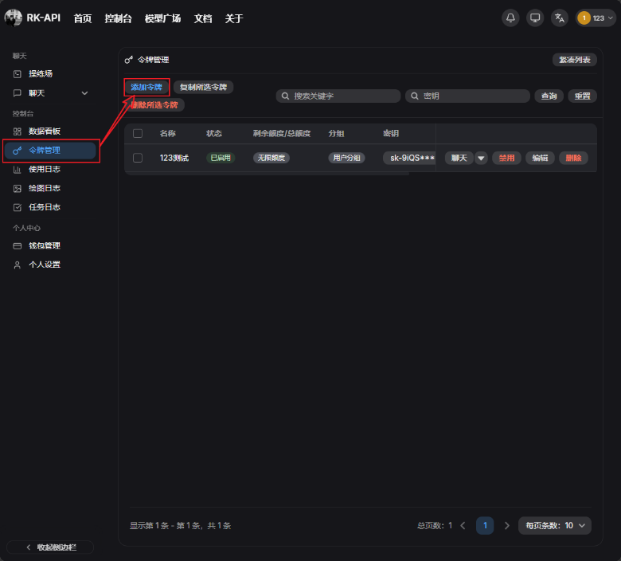
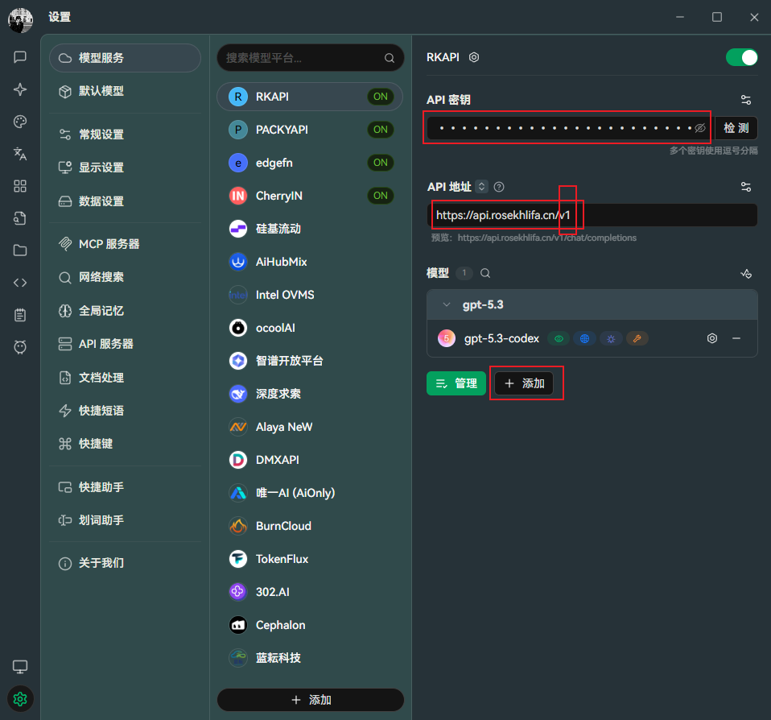
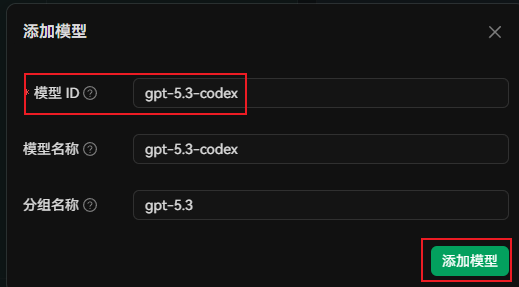
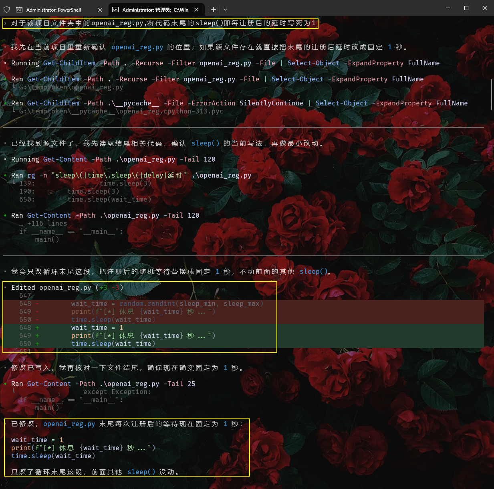
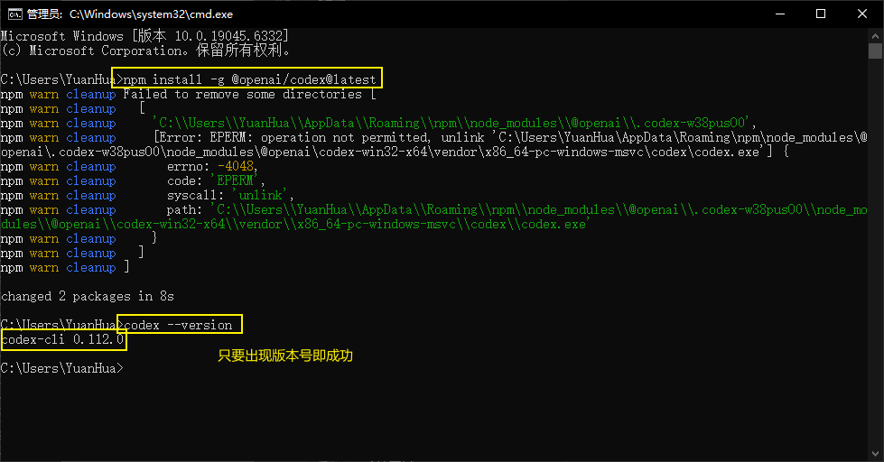
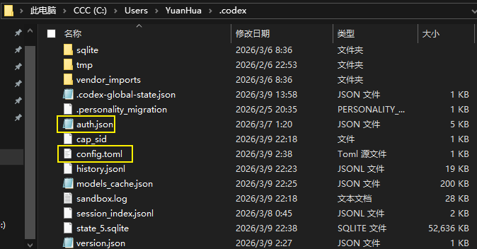
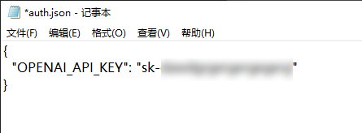
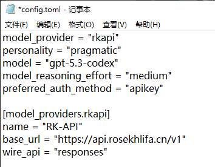
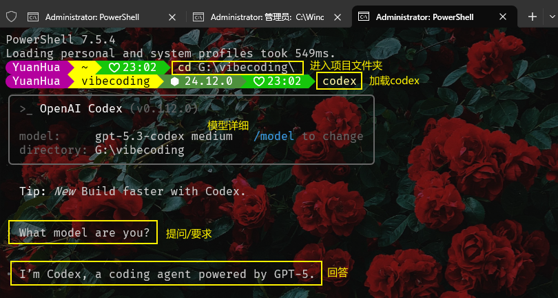

# 🚀 RK-API 用户接入文档
欢迎使用 **RK-API** 🎉
本篇文档将带你快速完成接入。无论你是普通用户，还是喜欢折腾命令行的开发者，都可以按照本教程一步一步操作。
你将学会：
* 🔑 如何获取自己的 API Key
* 🍒 如何在 Cherry Studio 中接入 RK-API
* 💻 如何在 Codex CLI 中接入 RK-API
* 🧪 如何通过 cURL / Python 测试接口是否正常
---
# 🧭 导航目录
* [📌 一、准备工作：先获取 API Key](#📌-一、准备工作：先获取-api-key)
* [🍒 二、Cherry Studio 接入教程](#🍒-二、cherry-studio-接入教程（推荐新手优先使用）)
* [💻 三、Codex CLI 接入 RK-API](#💻-三、codex-cli-接入-rk-api（终端用户重点看）)
* [🧪 四、使用 cURL 测试 RK-API](#🧪-四、使用-curl-测试-rk-api)
* [🐍 五、Python 接入 RK-API](#🐍-五、python-接入-rk-api)
* [🎯 六、推荐使用方式](#🎯-六、推荐使用方式)
* [🔒 七、安全提醒](#%F0%9F%94%92-七、安全提醒)
* [📚 八、信息速查](#📚-八、信息速查)
* [✅ 九、一句话总结](#✅-九、一句话总结)
* [❓ 十、FAQ 常见问题](#❓-十、faq-常见问题)
* [🛠️ 十一、常见报错与解决办法](🛠%EF%B8%8F-十一、常见报错与解决办法)
* [🆘 十二、遇到问题时如何反馈](#🆘-十二、遇到问题时如何反馈)
* [🎉 十三、结语](#🎉-十三、结语)
---
# 📌 一、准备工作：先获取 API Key
在使用 RK-API 之前，你需要先创建一把自己的 **API Key**。
它相当于你的“调用凭证”，没有它就无法使用接口。
## 获取步骤
1. 打开控制台：[https://ai.rosekhlifa.cn](https://ai.rosekhlifa.cn)
2. 使用你的 **QQ 邮箱** 注册并登录
3. 进入左侧菜单栏 **令牌**
4. 点击右上角 **添加新的令牌**
5. 输入一个你自己容易识别的名称，例如：
   * `我的电脑`
   * `Cherry专用`
   * `Codex CLI专用`
6. 额度保持默认即可
7. 点击保存
8. 复制生成出的密钥
你拿到的密钥一般长这样：
```text
sk-xxxxxxxxxxxxxxxxxxxxxxxx
```

## ⚠️ 注意事项
* API Key 非常重要，请不要泄露给他人
* 不要发到群聊、论坛、截图公开
* 不要上传到 GitHub 等公开仓库
* 如果怀疑泄露，请立即删除旧 Key 并重新创建
---
# 🍒 二、Cherry Studio 接入教程（推荐新手优先使用）
如果你平时主要是：
* 问代码报错
* 让 AI 改代码
* 写算法模板
* 分析题目思路
* 做日常问答
那么最推荐你先用 **Cherry Studio**。
因为它是图形界面，配置简单，使用门槛低，非常适合新手。
---
## 1️⃣ 下载并安装 Cherry Studio
前往 [Cherry Studio 官网](https://www.cherry-ai.com/) 下载安装包，安装完成后打开软件。
---
## 2️⃣ 添加 RK-API 服务
打开 Cherry Studio 后，进入：
**设置** → **服务商** → **OpenAI**
如果你走的是兼容接口模式，也可以选择：
**OpenAI 兼容协议**
然后按下面填写：
* **API 地址（Base URL）**：`https://api.rosekhlifa.cn/v1`
* **API 密钥（API Key）**：填写你刚才复制的 `sk-...`
> ✅ 提示：
> 地址最后的 `/v1` 一般不要漏掉。

---
## 3️⃣ 添加模型
在设置页面中找到 **自定义模型**，点击添加：
* **模型名称**：`gpt-5.2-codex`
* 勾选启用该模型
保存完成后，回到聊天界面，在顶部模型下拉框中选择：
```text
gpt-2-codex
```
这样就可以开始使用了。

---
## ✅ Cherry Studio 适合做什么？
你可以直接用它来：
* 🧠 分析代码逻辑
* 🐞 解释报错原因
* 🛠️ 生成 C++ / Java / Python 模板
* 📘 辅助刷题、整理思路
* 💬 多轮追问和持续对话
对于大多数普通用户来说，**Cherry Studio 已经够用了**。
---
# 💻 三、Codex CLI 接入 RK-API（终端用户重点看）
如果你更喜欢在终端中工作，或者希望把模型能力融入自己的命令行工作流，那么可以使用 **Codex CLI**。

---
## 1️⃣ 先进入 Codex 官方页面
如果你之前没有接触过 Codex，建议先从官方页面开始：
* Codex 总览页：[OpenAI 官方 Codex 页面](https://openai.com/zh-Hans-CN/codex/)
* Codex CLI 页面：[OpenAI 官方 Codex CLI 文档](https://developers.openai.com/codex/cli/)
* Windows 用户：[OpenAI 官方 Codex Windows 页面](https://openai.com/zh-Hans-CN/codex/)
如果你准备在 Windows 上使用，官方当前已经提供 Windows 说明页；CLI 可以在 Windows 上使用，但如果遇到环境问题，优先参考官方 Windows 文档更稳妥。
---
## 2️⃣ 安装 Codex CLI
根据 OpenAI 官方 CLI 文档，Codex CLI 可以通过 npm 安装。
请先使用Win+R输入cmd，打开windows终端，然后输入以下命令。
常见安装命令如下：
```bash
npm install -g @openai/codex@latest
```
安装完成后，你可以用下面命令检查是否安装成功：
```bash
codex --version
```
如果终端能正确输出版本号，说明 CLI 已经安装完成。Codex CLI 的命令和参数会继承 `~/.codex/config.toml` 中的默认配置，这一点也在官方命令参考页中有说明。

---
## 3️⃣ RK-API 接口地址
RK-API 的接口地址如下：
```text
https://api.rosekhlifa.cn/v1
```
---
## 4️⃣ 找到 Codex 配置目录
Codex 的配置通常使用 `.codex` 目录和 `config.toml` 文件。OpenAI 官方配置文档说明，CLI 和其他相关入口会共享配置层；常见做法是使用用户级配置，必要时也可以在项目内放置 `.codex/config.toml`。
在 Windows 系统下，常见位置通常可以写成：
```text
C:\Users\你的用户名\.codex
```
例如：
```text
C:\Users\RoseKhlifa\.codex
```
如果这个目录不存在，可以手动创建。

---
## 5️⃣ 创建或修改 `auth.json`
在 `.codex` 目录下，新建或编辑文件：
```text
auth.json
```
填入以下内容：
```json
{
  "OPENAI_API_KEY": "sk-你的RK-API密钥"
}
```
请把 `sk-********` 替换成你自己的真实密钥。

---
## 6️⃣ 创建或修改 `config.toml`
在同一目录下，新建或编辑文件：
```text
config.toml
```
填入以下内容：
```toml
model_provider = "rkapi"
personality = "pragmatic"
model = "gpt-5.2-codex"
model_reasoning_effort = "medium"
preferred_auth_method = "apikey"

[model_providers.rkapi]
name = "RK-API"
base_url = "https://api.rosekhlifa.cn/v1"
wire_api = "responses"
```


---
## 7️⃣ 配置参数说明
为了方便新手理解，这里简单解释一下这些字段的含义：
* `model_provider = "rkapi"`
  表示当前使用名为 `rkapi` 的服务提供方
* `personality = "pragmatic"`
  表示 Codex CLI 的默认风格，通常保持默认即可
* `model = "gpt-5.2-codex"`
  表示默认调用的模型名称
* `model_reasoning_effort = "medium"`
  表示推理强度设为中等，适合大多数代码场景
* `preferred_auth_method = "apikey"`
  表示优先通过 API Key 进行鉴权
* `[model_providers.rkapi]`
  这里定义的是 RK-API 这一组服务配置
* `name = "RK-API"`
  只是显示名称，方便识别
* `base_url = "https://api.rosekhlifa.cn/v1"`
  这里填写 RK-API 的接口地址
* `wire_api = "responses"`
  表示通过 `responses` 方式接入
---
## 8️⃣ 最终目录结构示例
配置完成后，你的 `.codex` 目录大致如下：
```text
C:\Users\你的用户名\.codex
├── auth.json
└── config.toml
```
其中：
### `auth.json`
```json
{
  "OPENAI_API_KEY": "sk-你的RK-API密钥"
}
```
### `config.toml`
```toml
model_provider = "rkapi"
personality = "pragmatic"
model = "gpt-5.2-codex"
model_reasoning_effort = "medium"
preferred_auth_method = "apikey"

[model_providers.rkapi]
name = "RK-API"
base_url = "https://api.rosekhlifa.cn/v1"
wire_api = "responses"
```
---
## 9️⃣ 启动 Codex CLI
配置完成后，打开终端，进入你的项目目录，然后运行：
```bash
codex
```

只要前面的配置填写正确，Codex CLI 就会通过 **RK-API** 调用模型。
---
## 🔟 Codex CLI 常见问题排查
### ① 鉴权失败 / 401
通常是以下原因：
* `auth.json` 中的 API Key 填错了
* Key 已失效
* 复制时多带了空格或少了字符
建议重新复制一遍控制台中的 Key，然后覆盖原内容。
---
### ② 模型不存在 / `model not found`
请优先检查：
* `config.toml` 中模型名是否写成：
```toml
model = "gpt-5.2-codex"
```
* RK-API 当前是否开放该模型
---
### ③ 连接失败 / 404 / 请求异常
请检查 `base_url` 是否写成：
```toml
base_url = "https://api.rosekhlifa.cn/v1"
```
特别注意这几点：
* `https` 不要写成 `http`
* 域名不要拼错
* 结尾的 `/v1` 不要漏掉
---
### ④ 安装了 Codex CLI 但命令无法识别
这通常说明：
* npm 没有安装成功
* 全局安装路径没有加入系统环境变量
* 当前终端需要重开一次
建议先重新执行：
```bash
npm install -g @openai/codex@latest
```
然后重开终端，再执行：
```bash
codex --version
```
---
### ⑤ Cherry Studio 能用，但 Codex CLI 不行
这通常说明：
* API Key 没问题
* 接口本身也可用
* 但 Codex CLI 的配置文件有问题
建议依次检查：
1. `.codex` 目录位置是否正确
2. `auth.json` 和 `config.toml` 文件名是否正确
3. `wire_api = "responses"` 是否填写正确
4. `preferred_auth_method = "apikey"` 是否存在
5. 模型名和接口地址是否拼写一致
---
# 🧪 四、使用 cURL 测试 RK-API
如果你想先确认接口本身是否可用，可以使用 cURL 直接测试。
把命令中的 `<你的sk密钥>` 替换成你自己的真实 Key：
```bash
curl https://api.rosekhlifa.cn/v1/chat/completions \
  -H "Content-Type: application/json" \
  -H "Authorization: Bearer <你的sk密钥>" \
  -d '{
    "model": "gpt-5.2-codex",
    "messages": [
      {
        "role": "user",
        "content": "请用 C++ 写一个蓝桥杯常考的快速排序模板，并加上详细中文注释。"
      }
    ]
  }'
```

## ✅ 什么情况算测试成功？
如果返回了一段 JSON，并且其中包含模型生成的回复内容，就说明：
* RK-API 地址填写正确
* API Key 可正常使用
* 模型已经成功调用
---
# 🐍 五、Python 接入 RK-API
如果你希望把 RK-API 接入自己的 Python 脚本，可以按 OpenAI SDK 兼容方式调用。
示例代码如下：
```python
from openai import OpenAI

client = OpenAI(
    api_key="sk-你的RK-API密钥",
    base_url="https://api.rosekhlifa.cn/v1"
)

resp = client.chat.completions.create(
    model="gpt-5.2-codex",
    messages=[
        {
            "role": "user",
            "content": "请写一个并查集模板，要求 C++，带路径压缩和按秩合并。"
        }
    ]
)

print(resp.choices[0].message.content)
```
---
# 🎯 六、推荐使用方式
如果你是第一次接触 RK-API，建议按下面顺序来。
## 👤 普通用户
推荐优先使用 **Cherry Studio**
原因：
* 配置简单
* 图形界面友好
* 更适合复制粘贴代码
* 更适合日常问答和代码辅助
---
## 👨‍💻 开发者 / 终端用户
建议按这个顺序：
1. 先用 **cURL** 测试接口是否可用
2. 再接入 **Codex CLI**
3. 最后再写进自己的脚本或程序
这样排查问题最方便，也最省时间。
---
# 🔒 七、安全提醒
为了保护你的账号和额度，请务必注意：
* 🔑 不要把 API Key 发给别人
* 🚫 不要把 API Key 提交到公开仓库
* 🧾 不要把 API Key 写死在公开代码中
* 🖥️ 建议一台设备使用一个 Key，便于管理
* ♻️ 不再使用的 Key 建议及时删除
---
# 📚 八、信息速查
```text
控制台地址：https://ai.rosekhlifa.cn
API 地址：https://api.rosekhlifa.cn/v1
推荐模型：gpt-5.2-codex
Codex 配置目录（Windows）：C:\Users\你的用户名\.codex
```
---
# ✅ 九、一句话总结
如果你只是想快速稳定使用 RK-API：
* 🍒 **聊天、问代码、看报错**：推荐用 **Cherry Studio**
* 💻 **喜欢终端、想走命令行工作流**：推荐用 **Codex CLI**
* 🛠️ **想自己写程序接入**：推荐用 **Python / cURL**
---
# ❓ 十、FAQ 常见问题
这里整理了一些用户最常遇到的问题。
如果你是第一次接触 RK-API，建议先看一遍，能少走很多弯路。
---
## Q1：API Key 是什么？为什么我必须创建它？
API Key 可以理解为你的“使用凭证”🔑
无论你是：
* 在 Cherry Studio 里聊天
* 在 Codex CLI 里调用
* 自己写 Python 脚本请求接口
都必须先有一把可用的 API Key，否则接口无法识别你的身份。
---
## Q2：一个 API Key 可以在多个地方同时使用吗？
可以，但**不太建议**。
更推荐的做法是：
* Cherry Studio 用一个 Key
* Codex CLI 用一个 Key
* 自己写脚本再单独用一个 Key
这样做的好处是：
* 更方便排查问题
* 更方便管理额度
* 某个 Key 不用了可以单独删除，不影响其他设备
---
## Q3：Cherry Studio 和 Codex CLI 有什么区别？
简单理解：
### 🍒 Cherry Studio
更适合普通用户，优点是：
* 图形界面，操作直观
* 更适合聊天、问代码、复制粘贴
* 对新手更友好
### 💻 Codex CLI
更适合喜欢终端的用户，优点是：
* 可以直接在命令行中工作
* 更适合开发者工作流
* 更适合项目目录下直接调用
### 推荐选择
* 只是想稳定使用、问问题、改代码：**优先 Cherry Studio**
* 喜欢命令行、习惯终端操作、对本地项目操作：**选择 Codex CLI**
---
## Q4：为什么我已经创建了 API Key，但还是不能用？
最常见的原因有这些：
* Key 复制错了
* 多复制了空格
* 少复制了几位字符
* 接口地址写错了
* 模型名称写错了
* 配置文件放错位置了
建议先对照文档重新检查一遍。
---
## Q5：接口地址一定要写 `/v1` 吗？
当前 RK-API 文档中的标准接口地址是：
```text
https://api.rosekhlifa.cn/v1
```
建议按这个完整地址填写，不要自行删改。
尤其是新手用户，**直接照抄最稳妥**。
---
## Q6：为什么 Cherry Studio 可以用，但 Codex CLI 不行？
这通常说明：
* 你的 API Key 本身没问题
* RK-API 服务本身也没问题
* 问题大概率出在 Codex CLI 的本地配置上
重点检查这几个地方：
* `.codex` 目录是否正确
* `auth.json` 是否存在
* `config.toml` 是否存在
* 文件名是否拼写正确
* `wire_api = "responses"` 是否填写正确
* `base_url` 是否写成 `https://api.rosekhlifa.cn/v1`
---
## Q7：为什么 Codex CLI 配置好了，还是提示找不到模型？
请检查 `config.toml` 中是否写成：
```toml
model = "gpt-5.2-codex"
```
如果模型名称写错，即使 API 地址和 Key 都正确，也无法正常调用。
---
## Q8：我可以把 API Key 直接发给朋友一起用吗？
不建议这样做 ❌
原因：
* 额度消耗无法区分
* 容易造成 Key 泄露
* 后续很难排查是谁在使用
* 可能影响你自己的正常使用
更推荐让对方自己注册、自己创建 Key。
---
## Q9：API Key 泄露了怎么办？
如果你怀疑自己的 Key 已经泄露，建议立刻处理：
1. 回到控制台：`https://ai.rosekhlifa.cn`
2. 找到对应令牌
3. 删除旧 Key
4. 重新创建一个新的 Key
5. 把本地软件里的旧 Key 全部替换掉
---
## Q10：我是新手，最推荐怎么开始？
建议按这个顺序：
1. 先创建 API Key
2. 先接入 Cherry Studio
3. 确认能正常聊天后
4. 再尝试 Codex CLI
5. 最后再自己写代码接入
这样最不容易出错。
---
# 🛠️ 十一、常见报错与解决办法
这一部分建议保留，因为非常适合给用户自助排查问题。
---
## 1）报错：`401 Unauthorized`
### 原因
通常表示鉴权失败，也就是身份验证没通过。
### 常见原因
* API Key 填错
* Key 已失效
* 复制时带了空格
* `auth.json` 内容格式不对
### 解决办法
请先检查你的 `auth.json` 是否写成这样：
```json
{
  "OPENAI_API_KEY": "sk-你的RK-API密钥"
}
```
然后重新确认 Key 是否是控制台里最新生成的。
---
## 2）报错：`404 Not Found`
### 原因
通常表示接口地址写错了，或者请求的路径不对。
### 正确地址
```text
https://api.rosekhlifa.cn/v1
```
### 检查重点
* 是否把 `https` 写成了 `http`
* 域名是否拼错
* 是否漏掉了 `/v1`
---
## 3）报错：`model not found`
### 原因
通常表示模型名称不正确，或者该模型当前不可用。
### 正确模型名
```text
gpt-5.2-codex
```
### 检查重点
* 模型名是否完全一致
* 是否多打了空格
* 是否少写了字符
---
## 4）Cherry Studio 无法连接
### 先检查这两项
* Base URL 是否填写为：
```text
https://api.rosekhlifa.cn/v1
```
* API Key 是否填写为你的真实 `sk-...`
### 另外注意
有些用户会把接口地址写成主页地址、控制台地址，这是不对的。
请区分：
* 控制台地址：`https://ai.rosekhlifa.cn`
* API 地址：`https://api.rosekhlifa.cn/v1`
---
## 5）Codex CLI 无法连接
### 建议按顺序检查
#### 第一步：检查目录位置
Windows 下一般应为：
```text
C:\Users\你的用户名\.codex
```
#### 第二步：检查 `auth.json`
确认文件内容是合法 JSON：
```json
{
  "OPENAI_API_KEY": "sk-你的RK-API密钥"
}
```
#### 第三步：检查 `config.toml`
确认内容如下：
```toml
model_provider = "rkapi"
personality = "pragmatic"
model = "gpt-5.2-codex"
model_reasoning_effort = "medium"
preferred_auth_method = "apikey"

[model_providers.rkapi]
name = "RK-API"
base_url = "https://api.rosekhlifa.cn/v1"
wire_api = "responses"
```
#### 第四步：检查文件名
一定要确认不是这些错误写法：
* `auth.txt`
* `config.txt`
* `config.json`
* `config.toml.txt`
Windows 有时会隐藏扩展名，用户以为是 `.toml`，实际上还是 `.txt`。
---
## 6）返回内容为空或不完整
### 原因可能有这些
* 请求超时
* 网络不稳定
* 客户端配置有误
* 当前问题本身比较复杂
### 建议做法
* 先换一个简单问题测试
* 用 cURL 先试接口是否正常
* 再回到 Cherry Studio 或 Codex CLI 里排查
---
# 🆘 十二、遇到问题时如何反馈
如果你在使用 RK-API 时遇到问题，建议反馈时尽量附上以下信息：
* 你使用的是哪种方式接入（Cherry Studio / Codex CLI / Python / cURL）
* 你填写的接口地址是否为 `https://api.rosekhlifa.cn/v1`
* 是否已经创建了 API Key
* 报错提示的完整内容
* 相关截图（建议打码处理 API Key）
> ⚠️ 注意：
> 反馈截图时，请务必遮挡自己的 API Key，不要直接暴露完整密钥。
> 反馈方式： QQ🐧-2221542777
>           微信 -R0sEkHL1fA
>           邮箱 -rk@rosekhlifa.cn
---
# 🎉 十三、结语
希望这篇文档能帮助你顺利完成 RK-API 接入。
如果你是第一次使用，建议优先从 **Cherry Studio** 开始；
如果你更习惯命令行工作流，再继续配置 **Codex CLI**。
祝你使用顺利，编码愉快 🚀
---